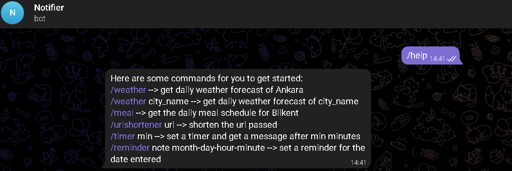
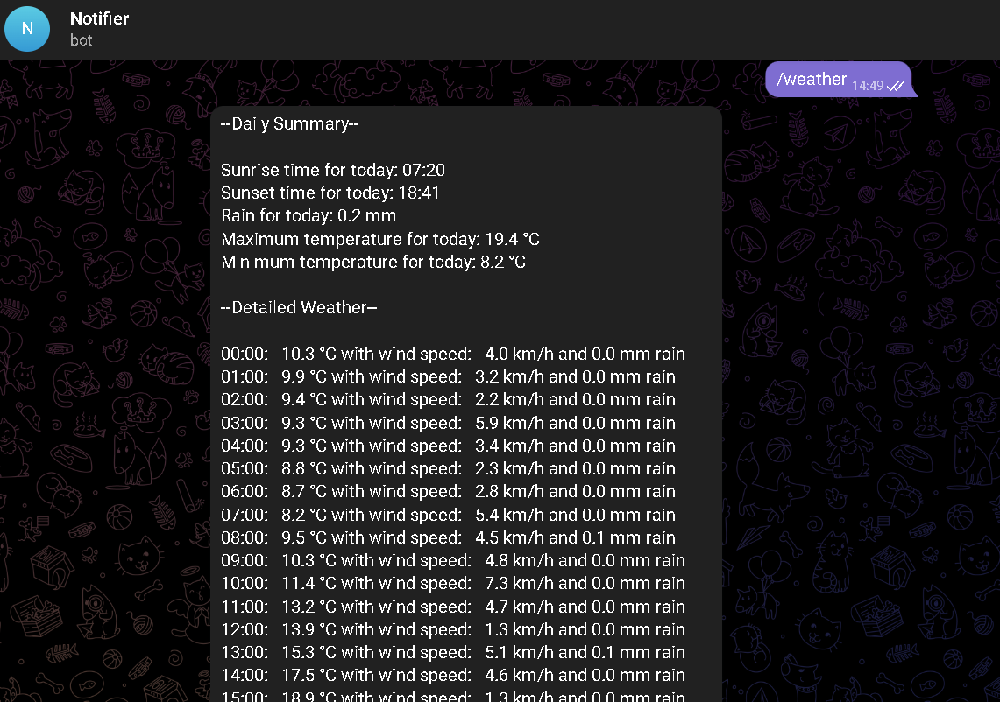

# Telegram_Bot

- User friendly telegram bot to make it easier to access frequently used information and services.

- Usage is as simple as typing "/{command_name}".

- Type /help to get a list of commands available.

- Daily Bilkent meal schedule and daily weather forecast are available.

- Url shortener and reminder functionalities can be used too.

